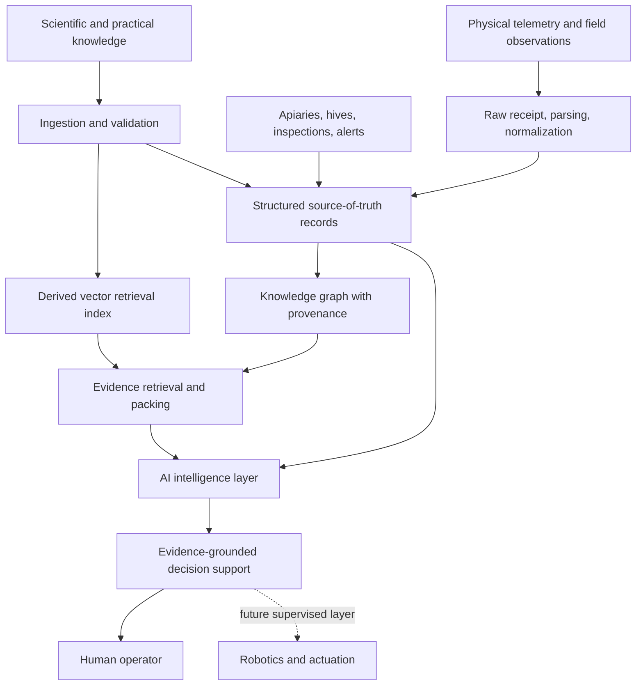

# High-Level Architecture

This document is a sanitized overview. It intentionally avoids proprietary source code, prompts, database schemas, internal endpoint maps, implementation algorithms, credentials, private datasets, and Git history.

## Conceptual Flow

## Current System Shape

The private implementation is a modular monolith with two runtime planes:

- API/app plane: HTTP API, authentication/session behavior, workspace operations, admin/operator surfaces, retrieval orchestration, and the AI assistant.
- Worker/offline plane: document ingestion, chunking, validation, reindexing, repair, replay, knowledge graph maintenance, and publish/rebuild work.

PostgreSQL is the system of record. Chroma is a derived retrieval index that can be rebuilt from relational state. Knowledge graph records are derived state with provenance back to accepted source material.

## Implemented Conceptual Domains

The codebase separates major responsibilities into bounded areas:

- authentication and session handling
- apiaries and hives
- devices, sensors, and telemetry
- readings and normalization
- alerts and alert lifecycle
- inspections and hive operation history
- document ingestion and validation
- retrieval and vector indexing
- knowledge graph extraction and evidence
- deterministic AI assistant orchestration
- admin, observability, and production safety

## Intelligence Layer

The intelligence layer is designed around evidence rather than unconstrained autonomy.

At a high level it:

1. receives a user question
2. classifies whether it is general education or operational hive-specific reasoning
3. retrieves relevant evidence from accepted knowledge and owned operational data
4. optionally expands context through graph-backed evidence
5. builds a bounded prompt from already-resolved inputs
6. generates an answer
7. filters citations and support back through known evidence identifiers
8. persists trace data for audit, review, and debugging

This is not an autonomous multi-agent swarm. It is a deterministic RAG and decision-support pipeline.

## Sensor and Operational Data Flow

The current sensor architecture separates:

- raw physical payload receipt
- parsed payload
- normalized reading
- stored reading
- alert evaluation
- evidence made available to the assistant

This matters because an agricultural system must preserve provenance. Raw telemetry should not disappear after a derived reading is created, and a device should not be assumed to remain permanently attached to one hive.

## Technology Blocks

Verified high-level components include:

- FastAPI backend
- PostgreSQL application database
- separate PostgreSQL identity database
- Chroma vector retrieval
- Docker and Docker Compose runtime
- React/Vite frontend
- Pico-based firmware support for temperature, humidity, and acoustic telemetry
- automated test and verification scripts

## What This Diagram Does Not Reveal

This public architecture intentionally excludes:

- production source files
- private prompts
- detailed database schema
- KG ontology internals
- proprietary retrieval or ranking implementation details
- private datasets and raw telemetry
- credentials or connection strings
- complete API surface and internal module map
- Git history

The goal is to communicate system maturity and direction without making the private implementation easy to reproduce.
